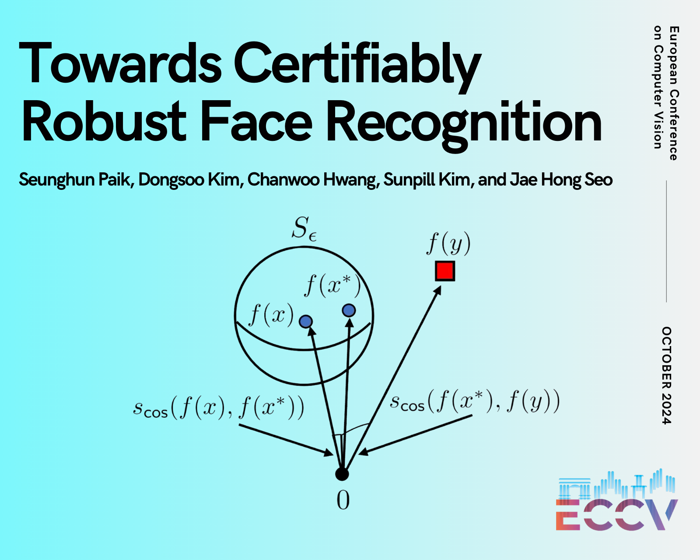

### Toward Certifiably Robust Face Recognition

- Seunghun Paik, Dongsoo Kim, Chanwoo Hwang, Sunpill Kim and Jae Hong Seo.
- Accepted for presentation at ECCV 2024



This repository is a source code for our paper entitled "Towards Certifiably Robust Face Recognition", which is accepted for presentation at ECCV 2024.

This code includes (1) the archtiecture and configuration for constructing and training our proof-of-concept implementation, (2) evaluation tools for certifiable / empirical robustness, and (3) reproducible codes for our tables & toy examples.

Note: Many parts of the training and evaluation codes for the face recognition model came from insightface, which is available at https://github.com/deepinsight/insightface/tree/master/recognition/arcface_torch. In addition, for implementing SLL, we used their author's official source code, which is available at https://github.com/araujoalexandre/lipschitz-sll-networks.

### Prerequisite

To run our source code, some packages, such as `PyTorch`, are required. Please refer to `requirements.txt`

You can get these parameters at the following links:

```https://drive.google.com/file/d/1ACf4c-ZHWHwtllpEQQh6XYx8fbzJJbSW/view?usp=sharing```


### Usage

The overall structure of our source code is as follows:

```
CertRobFR
├──backbones
    ├── __init__.py
    ├── custom_layers.py              # Implementation of SLL; Forked from https://github.com/araujoalexandre/lipschitz-sll-networks.
    ├── iresnet.py                    # Forked from https://github.com/deepinsight/insightface    
    ├── iresnet_AT.py                 # Due to compatibility issue; Forked from https://github.com/ShawnXYang/Face-Robustness-Benchmark
    ├── toyexamples.py                # Networks for toy examples on our analysis.
    └── sllnet.py                     # Where our backbones are stored.
├── eval                  
    ├── __init__.py
    └──verification.py                # Evaluation Codes; Forked from https://github.com/deepinsight/insightface
├── params                            # Put your pre-trained parameters here.
    └── *empty*                       # Training log for the proposed FR model.
├── logs                              
    ├── training_lln.log              # Logs for training the FR model with a LLN header.
    └── training_xi3.log              # Logs for training the proposed FR model.
├── utils                             # All codes this folder were forked from https://github.com/deepinsight/insightface
    ├── __init__.py
    ├── utils_callbacks.py            # Utilities for callbacks.
    ├── utils_distributed_sampler.py  # Utilities for dataset sampler.
    └── utils_logging.py              # Utilities for logging.
├── attacks.py                        # Implementation of PGD and C&W attacks.
├── config.py                         # Config for training the proposed model.
├── config_lln.py                     # Config for training the model with LLN header.
├── datasets.py                       # Setting up Train Dataset; Forked from https://github.com/deepinsight/insightface
├── headers.py                        # Implementation of Headers; Some parts were forked from https://github.com/deepinsight/insightface
├── lr_scheduler.py                   # Custom LR scheudler; Forked from https://github.com/deepinsight/insightface
├── train.py                          # Script for training the proposed model
├── train_lln.py                      # Script for training the model with LLN header.
├── CertRobFR_train.ipynb             # ipynb Notebook for training the proposed recognition model.
├── CertRobFR_eval.ipynb              # ipynb Notebook for reproducing Table 1 & 2.
├── CertRobFR_imagecls.ipynb          # ipynb Notebook for reproducing Appendix F.
└── CertRobFR_toyexamples.ipynb       # ipynb Notebook for reproducing the toy experimental results.
```

#### 1. Train the model

The code for training the attached model can be found in the .ipynb notebook`CertRobFR_train.ipynb`.

#### 2. Reproduce Table 1 & 2

The code for reproducing our results can be found in the .ipynb notebook`CertRobFR_eval.ipynb`. You can also test your face recognition model. Please follow the instructions described in this notebook.

Caveat. Note that the benchmark code rescales each pixel to the range from -0.5 to 0.5.

#### 3. Reproduce Toy Experiments

We also provide codes for reproducing toy experimental results provided in Section 3.2 (especially about classifiers for MNIST and CIFAR10 datasets). By following instructions in the .ipynb notebook`CertRobFR_toyexamples.ipynb`, you can reproduce Fig. 2 and the visualization of Fig. 1.b (Fig. 1 in the Supplementary material) on these datasets.

#### 4. Reproduce Appendix F

To demonstrate our analysis on face recognition models using last layer normalization technique in Section 4.2. and Appendix, we provide .ipynb notebook `CertRobFR_imagecls.ipynb` for reproducing Fig. 4 in Supplementary Material. In this notebook, we analyze losses, test accuracies, and average feature norms collected during training.
